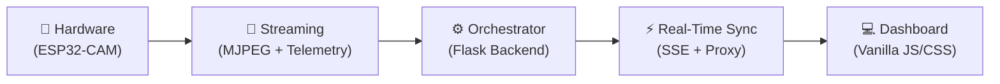
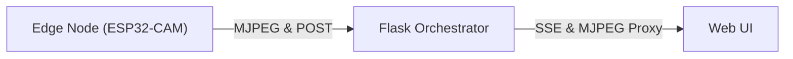

<p align="center">
  
</p>

<h1 align="center">🚗 ReckonBot</h1>

<p align="center">
  <strong>Full-Stack Vehicle-to-Everything (V2X) and Robotics Monitoring Platform</strong><br/>
  Real-time telemetry, low-latency video streaming, and operational command center for edge robotics.
</p>

<p align="center">
  
  
  
  
  
  
  
</p>

---

## 📋 Table of Contents

- [Project Overview](#-project-overview)
- [Key Features](#-key-features)
- [System Overview](#-system-overview)
- [System Architecture](#-system-architecture)
- [Hardware & Image Acquisition](#-hardware--image-acquisition)
- [Live Monitoring System](#-live-monitoring-system)
- [Web Application Platform](#-web-application-platform)
- [Development & API](#-development--api)
- [Getting Started](#-getting-started)
- [Deployment & Operations](#-deployment--operations)
- [Project Structure](#-project-structure)
- [Tech Stack](#-tech-stack)
- [Documentation](#-documentation)
- [Contributing](#-contributing)
- [License](#-license)

---

## 🌟 Project Overview

**ReckonBot** is an end-to-end operational command center designed for viewing live telemetry and low-latency video streams from edge robotics nodes. Leveraging a decoupled architecture, it integrates robust edge firmware with a high-performance HTTP orchestrator and a reactive frontend UI.

### The Problem

In V2X (Vehicle-to-Everything) and mobile robotics environments, real-time operational awareness is critical. Traditional remote monitoring setups often face:
- ❌ **High Latency** — delays in video streaming making remote operation impossible.
- ❌ **CORS & Network Restrictions** — difficulties in securely routing edge device streams to modern web browsers.
- ❌ **Polling Overheads** — inefficient telemetry updates causing UI stutter and server load.
- ❌ **Coupled Architectures** — monolithic designs that are hard to scale or deploy on constrained edge hardware.

### The Solution

ReckonBot solves these challenges by providing a highly optimized, decoupled data pipeline:
- 🔧 **Edge Optimization** (ESP32-CAM with direct-to-PSRAM buffering)
- 📡 **Video Proxying** (Flask orchestrator bypassing cross-origin restrictions)
- ⚡ **Event-Driven Telemetry** (Server-Sent Events for instant UI updates)
- 📊 **Responsive Command Dashboard** (Modular Vanilla JS/CSS for minimal overhead)

### Supported Applications

| Application | Description |
|---|---|
| Remote V2X Testing | Monitoring autonomous vehicle communications and state |
| Autonomous Fleet Monitoring | Centralized dashboard for multiple robotic nodes |
| Personal Robotics | Low-latency control and visual feedback for hobbyist rovers |

📄 *Full details:* [`docs/a01-system-overview.md`](docs/a01-system-overview.md)

---

## ✨ Key Features

| Feature | Description |
|---|---|
| 📹 **Low-Latency Streaming** | Proxy-routed MJPEG streams bypassing cross-origin restrictions |
| ⚡ **Live Telemetry Events** | Hardware sensor data ingestion via HTTP POST with real-time UI broadcasting via Server-Sent Events (SSE) |
| 📱 **Responsive Dashboard** | Modern, mobile-friendly multi-page application with modular CSS layouts |
| 🎨 **Dynamic Theming** | Persistent light/dark mode configurations |
| 🔧 **Firmware Optimization** | Custom C++ directives forcing direct-to-PSRAM camera frame buffers and dual-buffer MJPEG tuning |
| 📦 **Container-Ready** | Configured strictly via `ENV` variables in compliance with 12-Factor App principles |

---

## 🔍 System Overview

ReckonBot provides a continuous, real-time feedback loop between edge robotic nodes and human operators. The end-to-end workflow begins at the edge with the ESP32-CAM node, which continuously acquires sensory data and high-framerate MJPEG video.



### Technology Stack at a Glance

| Layer | Technology | Purpose |
|---|---|---|
| **Hardware** | ESP32-CAM (C++) | Image capture, telemetry, WiFi streaming |
| **Streaming** | MJPEG & HTTP POST | Video and sensor data transmission |
| **Backend** | Python + Flask | API server, stream proxy, SSE management |
| **Frontend** | HTML5 / CSS3 / Vanilla JS | Command dashboard and visualizations |

📄 *Full details:* [`docs/a01-system-overview.md`](docs/a01-system-overview.md)

---

## 🏗️ System Architecture

ReckonBot employs a decoupled **Three-Tier Architecture**:

### High-Level Architecture



### Architecture Layers

| Tier | Layer | Responsibility |
|---|---|---|
| 1 | **Edge Node** | ESP32-CAM microcontrollers connected to physical sensors and motors. Hosts lightweight micro-servers. |
| 2 | **Backend Orchestrator** | Central hub exposing RESTful APIs, managing SSE, and proxying video to resolve CORS. |
| 3 | **Web UI** | Responsive frontend providing the command dashboard, theme management, and live visualizations. |

📄 *Full details:* [`docs/02-system-architecture.md`](docs/02-system-architecture.md)

---

## 🔧 Hardware & Acquisition

At the physical layer, ReckonBot utilizes **ESP32-CAM** modules. The custom C++ firmware is deeply optimized for performance.

### Camera Performance Settings

| Feature | Value |
|---|---|
| Resolution | **640x480 (VGA)** — optimal for 15-20 FPS |
| Buffering | Direct-to-PSRAM |
| Frame Buffers | Dual-buffer tuning |
| JPEG Quality | 10-12 (lower = better quality) |

### Key Hardware Features

- **Direct-to-PSRAM Buffering:** Ensures stable frame buffering for continuous video.
- **MJPEG Streaming:** Optimized for smooth delivery over WiFi.
- **Sensors & Telemetry:** Physical sensor states (e.g., speed, battery, IMU, ultrasonic) are collected and periodically transmitted via HTTP POST payloads.

📄 *Full details:* [`docs/03-hardware-and-acquisition.md`](docs/03-hardware-and-acquisition.md)

---

## 📡 Live Monitoring System

The monitoring pipeline is built for resilience and real-time responsiveness without the overhead of websockets.

### Pipeline Components

| Component | Description |
|---|---|
| **Telemetry Ingestion** | ESP32 nodes POST data to `/api/bot1/telemetry` |
| **In-Memory State Store** | Thread-safe Python structure (`TelemetryStore`) retains the latest state |
| **Server-Sent Events (SSE)** | Frontend subscribes to `/api/bot1/events` using the `EventSource` API |
| **Video Proxying** | Backend proxies the raw MJPEG stream natively to resolve Mixed Content issues |

📄 *Full details:* [`docs/04-monitoring-system.md`](docs/04-monitoring-system.md)

---

## 💻 Web Application Platform

The frontend is an aesthetically rich, responsive platform adhering to modern design principles, built without heavy JS frameworks for maximum performance.

### Platform Features

| Feature | Description |
|---|---|
| 🏠 **Public Landing Page** | Marketing site for the project |
| 📊 **Operational Dashboard** | Authenticated command center for robotic nodes |
| 🤖 **Bot-Specific Views** | Dedicated interfaces for individual nodes (e.g., `/bots/bot1`) |
| 🌓 **Dynamic Theming** | Built-in light/dark mode toggles with server-side persistence |
| 🧩 **Modular Components** | Organized JavaScript modules (`bot1.js`, `sidebar.js`) |

📄 *Full details:* [`docs/06-web-application-platform.md`](docs/06-web-application-platform.md)

---

## 🛠️ Development & API

ReckonBot provides a clean, unified API for edge integration.

### Core API Endpoints

| Method | Endpoint | Description |
|---|---|---|
| `POST` | `/api/bot1/telemetry` | Ingests JSON telemetry from the ESP32 robot |
| `GET` | `/api/bot1/state` | Returns the latest telemetry snapshot |
| `GET` | `/api/bot1/events` | Subscribes to the real-time SSE telemetry stream |
| `GET` | `/api/bot1/stream` | Accesses the proxy-routed camera MJPEG stream |

📄 *Full details:* [`docs/07-development-and-api.md`](docs/07-development-and-api.md)

---

## 🚀 Getting Started

### 1. Hardware Setup
1. Configure `secrets.h` in the `Hardware/src/esp32cam_app1/` directory with your WiFi credentials.
2. Flash the firmware to your ESP32-CAM module using the Arduino IDE.
3. Note the IP address printed in the Serial Monitor and set it as `CAMERA_HOST` in your `.env`.

### 2. Clone the Repository
```bash
git clone https://github.com/Mekesh-Engineer/ReckonBot.git
cd ReckonBot
```

### 3. Backend Installation
```bash
python -m venv venv
# On Windows:
venv\Scripts\activate
# On macOS/Linux:
source venv/bin/activate

pip install -r requirements.txt
```

### 4. Configuration
Copy the environment template:
```bash
cp .env.example .env
```
Update `.env` with your settings (`FLASK_APP`, `CAMERA_PROXY_ENABLE`, `CAMERA_HOST`).

### 5. Start the Server
```bash
flask run --host=0.0.0.0 --port=5000
```
Navigate to `http://localhost:5000` to access the platform.

---

## 📦 Deployment & Operations

ReckonBot follows 12-Factor App principles, making it container-ready and easy to deploy in production.

### Production Server (Gunicorn)
```bash
gunicorn 'app:create_app()' --bind 0.0.0.0:5000 --workers 4
```

📄 *Full details:* [`docs/08-deployment-operations-and-user-guide.md`](docs/08-deployment-operations-and-user-guide.md)

---

## 📁 Project Structure

```
ReckonBot/
├── app.py                  # Flask orchestration server
├── requirements.txt        # Python dependencies
├── .env.example            # Environment configuration template
├── Hardware/               # Edge firmware
│   └── src/
│       ├── camera_web_server/
│       ├── esp32cam_app1/  # Primary bot firmware
│       └── esp32cam_app2/
├── static/                 # Frontend assets
│   ├── css/                # Modular stylesheets
│   └── js/
│       └── modules/        # Vanilla JS logic modules
├── templates/              # Jinja2 HTML templates
│   ├── Landing/
│   ├── dashboard/
│   ├── macros/
│   └── partials/
└── docs/                   # Detailed documentation
```

---

## 📚 Documentation

ReckonBot includes comprehensive technical documentation:

| # | Document | Description |
|---|---|---|
| 01 | [System Overview](docs/a01-system-overview.md) | Project introduction, workflow, and objectives |
| 02 | [System Architecture](docs/02-system-architecture.md) | Three-tier architecture and component integration |
| 03 | [Hardware & Acquisition](docs/03-hardware-and-acquisition.md) | ESP32-CAM setup, buffering, and firmware tuning |
| 04 | [Live Monitoring](docs/04-monitoring-system.md) | Telemetry ingestion, SSE, and video proxying |
| 05 | [Web App Platform](docs/06-web-application-platform.md) | Dashboard features, theming, and frontend structure |
| 06 | [Development & API](docs/07-development-and-api.md) | API endpoints, environment vars, and dev workflow |
| 07 | [Deployment Guide](docs/08-deployment-operations-and-user-guide.md) | Production setup, operations, and hardware prep |

---

## 🤝 Contributing

Contributions are welcome! Please feel free to submit a Pull Request or open an Issue for bug reports and feature requests. 

1. **Fork** the repository
2. **Create** a feature branch (`git checkout -b feature/amazing-feature`)
3. **Commit** your changes (`git commit -m 'Add amazing feature'`)
4. **Push** to the branch (`git push origin feature/amazing-feature`)
5. **Open a Pull Request**

---

## 📄 License

This project is licensed under the **MIT License** — see the [LICENSE](LICENSE) file for details.

```
MIT License © 2026 Mekesh Engineer
```

---

<p align="center">
  <strong>Built with ❤️ for Robotics and Edge Computing by <a href="https://github.com/Mekesh-Engineer">Mekesh Engineer</a></strong>
</p>
